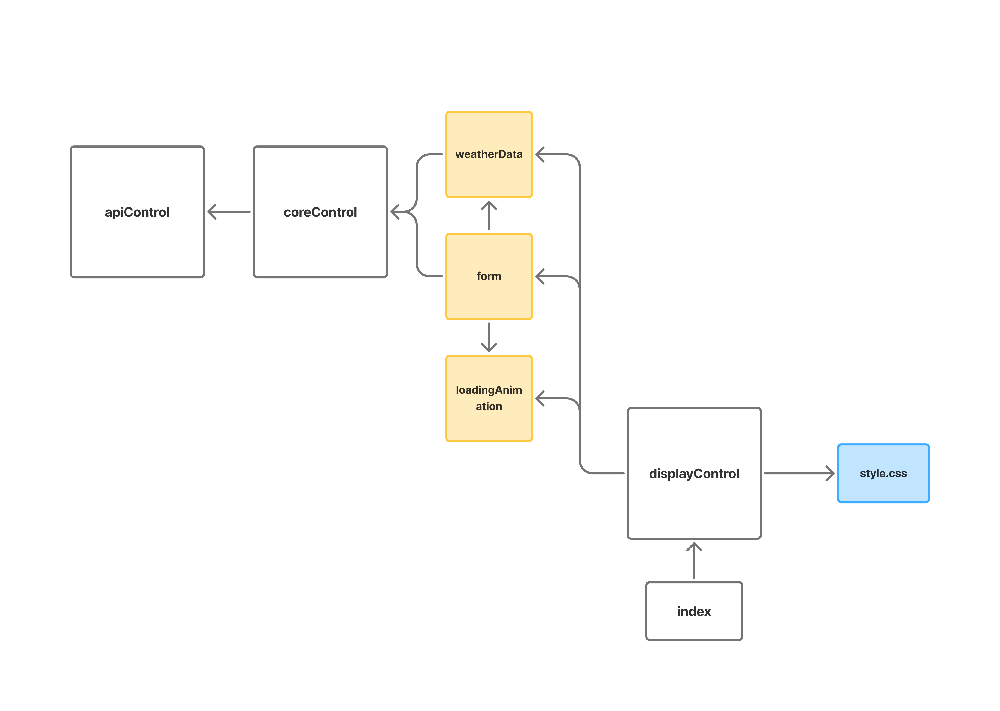

# weather-app

A basic webpage to fetch and display weather data from an API. Displays to the user any errors thrown by the API.

limitation: no confidentiality on the API key since we're not working with servers yet. 

<strong>major concepts exercised:</strong> 
- asynchronous code: promises, async/await
- error handling for asynchronous code
- fetching data from an API: reading its docs, url encoding, data processing, error handling
- OOP principles
- simulate network speeds in devtools

dependency chart:

</img>

credits:
- [Visual Crossing Weather API](https://www.visualcrossing.com/weather-api/)
- [Visual Crossing weather icons](https://github.com/visualcrossing/WeatherIcons/tree/main)
- [Tenor loading gif](https://media1.tenor.com/m/WX_LDjYUrMsAAAAC/loading.gif)

  
sources of help:

    <ul>
      <li>example display: https://www.visualcrossing.com/weather-forecast/united%20states/us/</li>
      <li>api HTTP response codes: https://www.visualcrossing.com/resources/documentation/weather-api/timeline-weather-api/#brxe-buhgdv</li>
      <li>encode url: https://stackoverflow.com/questions/332872/encode-url-in-javascript</li>
      <li>encodeURIComponent vs encodeURL: https://developer.mozilla.org/en-US/docs/Web/JavaScript/Reference/Global_Objects/encodeURIComponent#description</li>
      <li>MDN: Reponse object: https://developer.mozilla.org/en-US/docs/Web/API/Response</li>
      <li>getting data from a ReadableStream: https://stackoverflow.com/questions/40385133/retrieve-data-from-a-readablestream-object</li>
      <li>streaming data from a ReadableStream (unused): https://developer.mozilla.org/en-US/docs/Web/API/Fetch_API/Using_Fetch#streaming_the_response_body</li>
  </ul>

